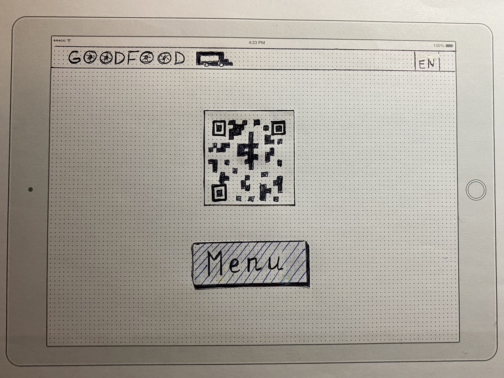
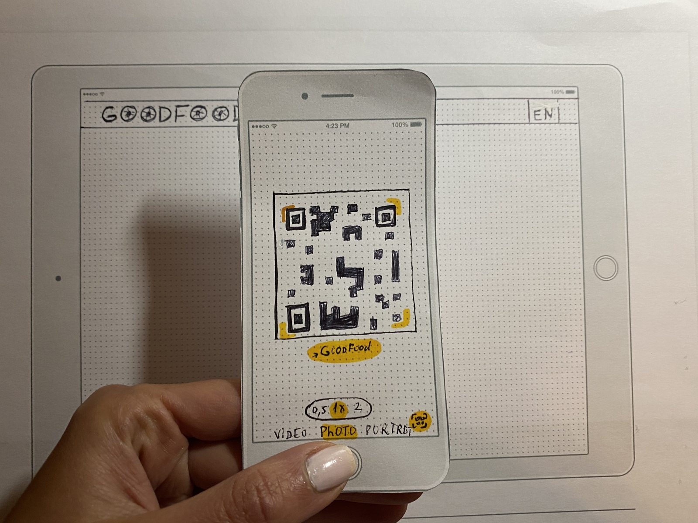
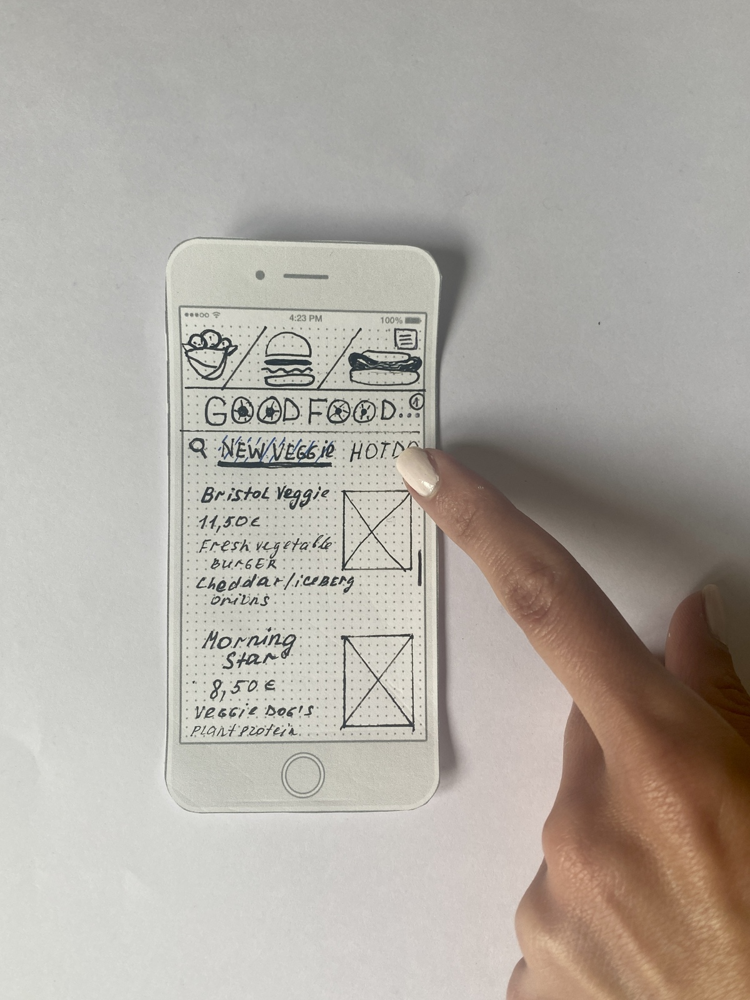
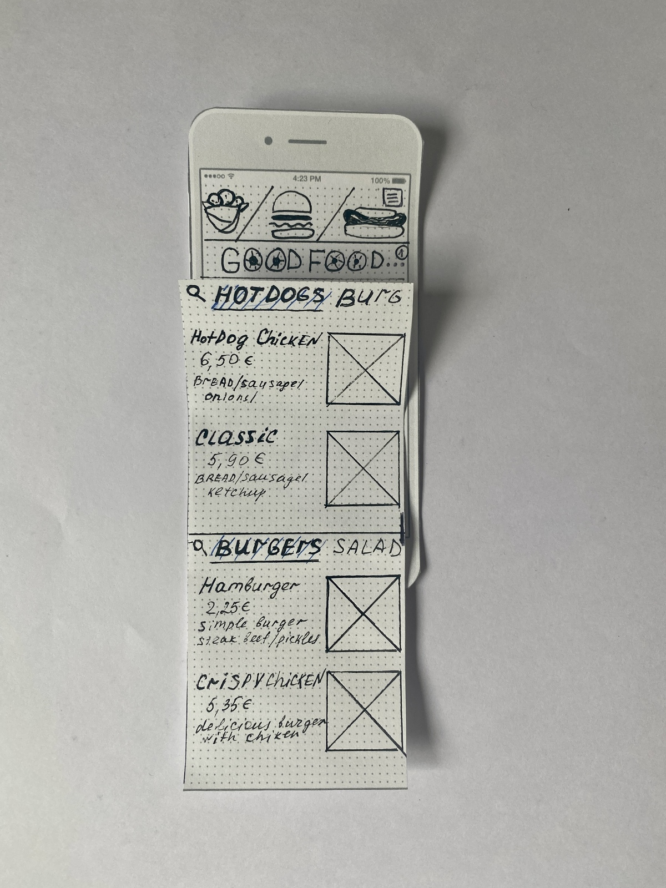
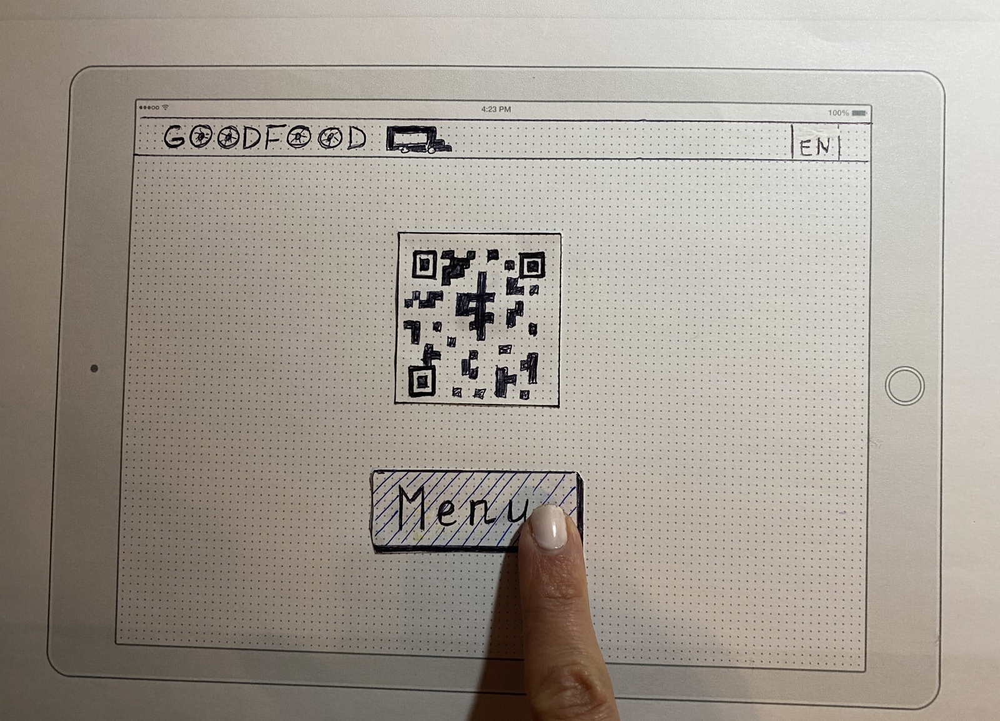
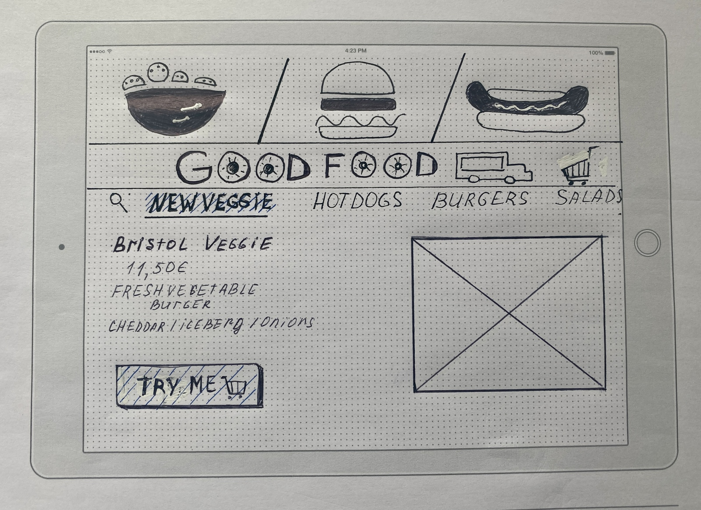
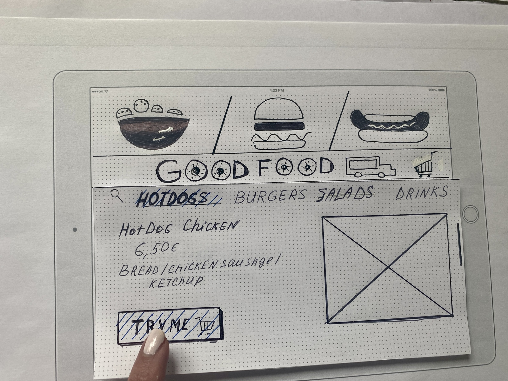
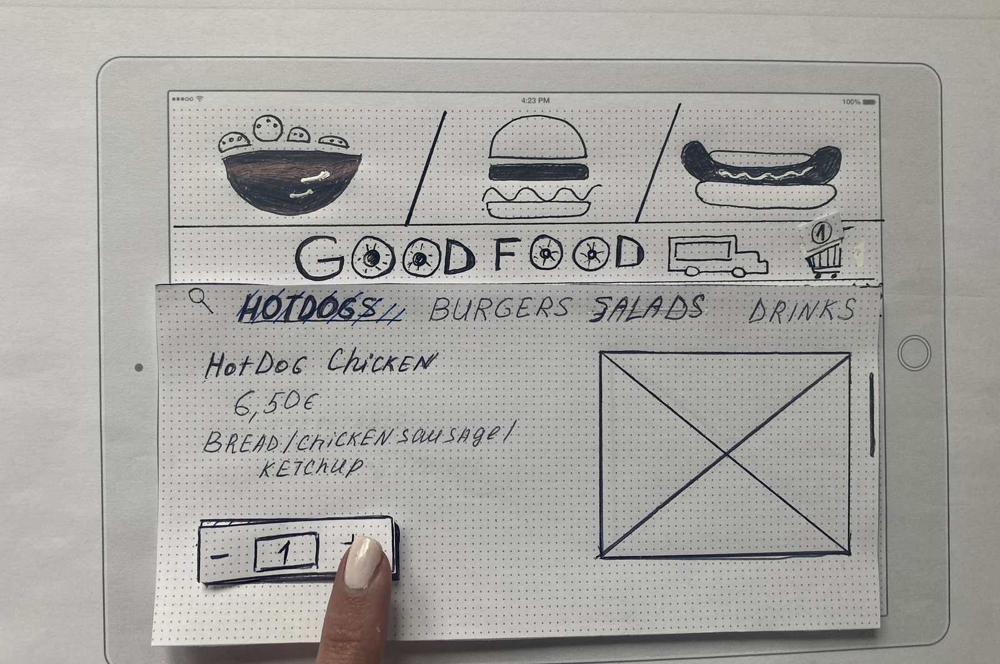

# Maria's design (Team-1)

This is my prototype trying to solve the problem of menu displaying in James' food trucks.

> I can't review full menu when queuing to make my order because I'am afraid to lose my place.

> The menu in a food truck is ofter unreadable or not up to date.

We decided to solve this problem by developing a site with a full menu and a possibility to make an order online. The site will be reachable from the embedded tablets as well as personal devices (mobile phones).

_An example of the existing solution_

_The first screen of an embedded tablet_

**Buttons highlighted with blue shading are clickable!**

_Client decided to scan QR code by his/her iphone to see the menu_

_Using personal phone screen clients can check the full menu in a queue_

_Scrolling left they can chose among different options (veggie, hotdog...) and see food beneath._

_Another option to see the menu and even make an order faster is to use the tablet embedded into the food truck._

_On the screen client can see bigger images of the food presented in the food truck..._

_and make their choice by clicking on "TRY ME" button_

_Tablet would be the best option for people who can't use their phones or want's to see the menu bigger._

